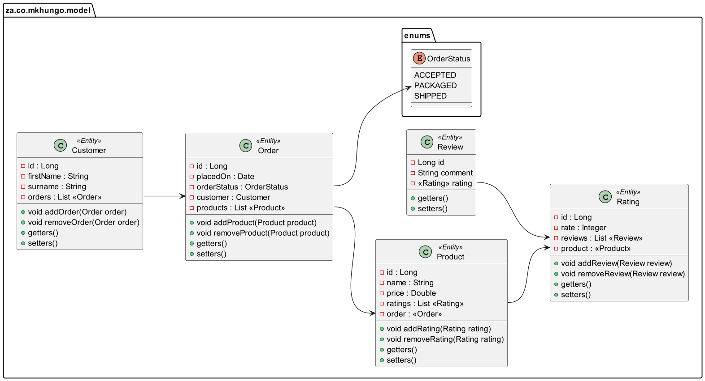
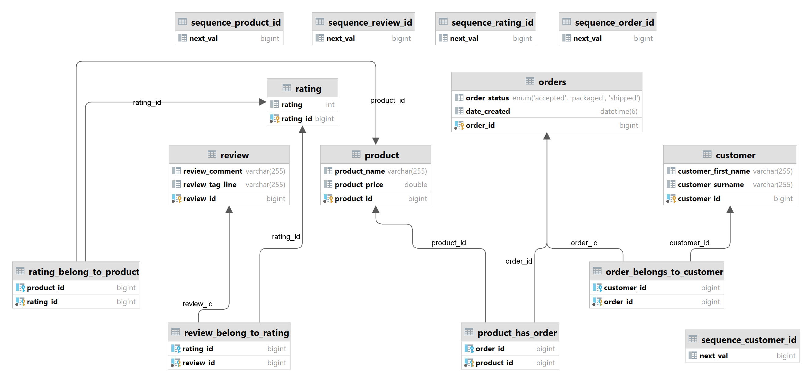
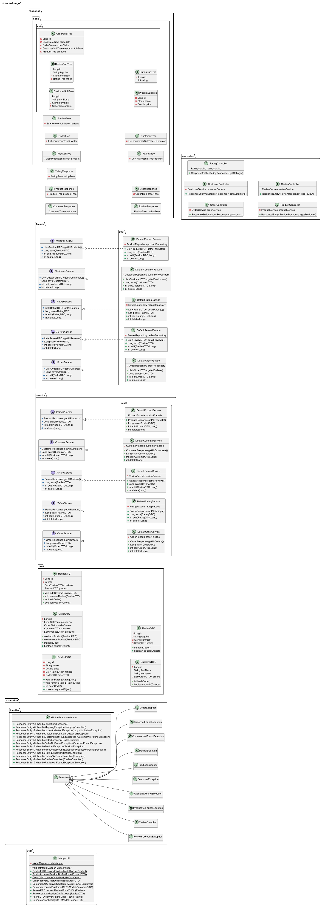

# Spring-Boot JSON Node Tree Model
### Introduction
Proof of concept Flat JSON into JSON Node Tree Model (hierarchical)
Breaking it into individual objects ,
Creating a root node, Connecting each object to its parent node ,
assembling nodes to form a tree and returning the completed tree structure.

 Hierarchical / Node Tree Model JSON
```
{
	"products": {
		"product": [
			{
				"id": 100,
				"name": "Chocolate bar",
				"price": 43.99,
				"ratings": {
					"rating": [
						{
							"id": 300,
							"rating": 4,
							"reviews": {
								"review": [
									{
										"id": 400,
										"tagLine": "Exceeded my expectations",
										"comment": "I loved the product",
										"links": []
									}
								]
							},
							"links": []
						}
					]
				},
				"links": [
					{
						"rel": "self",
						"href": "http://localhost:8080/products/100"
					},
					{
						"rel": "products",
						"href": "http://localhost:8080/products/"
					}
				]
			},
			{
				"id": 101,
				"name": "Still Water",
				"price": 75.22,
				"ratings": {
					"rating": []
				},
				"links": [
					{
						"rel": "self",
						"href": "http://localhost:8080/products/101"
					},
					{
						"rel": "products",
						"href": "http://localhost:8080/products/"
					}
				]
			},
			{
				"id": 102,
				"name": "Cool Drink",
				"price": 15.22,
				"ratings": {
					"rating": []
				},
				"links": [
					{
						"rel": "self",
						"href": "http://localhost:8080/products/102"
					},
					{
						"rel": "products",
						"href": "http://localhost:8080/products/"
					}
				]
			}
		],
		"links": []
	}
}
```



# Database Diagram


# Application Class Diagram


## Architecture : Design Pattern
- Microservice Architecture Design Pattern

# Technologies Used:

🔘   Springframework 6 <br/>
🔘   Spring-Data 3 <br/>
🔘   Hikari Connection Pool <br/>
🔘   Hibernate - ORM <br/>
🔘   MySQL Database <br/>
🔘   Jackson databind <br/>
🔘   swagger-ui - API Documentation <br/>

## License
This project is licensed with as CLOSED-SOURCE. See LICENSE file for details.
