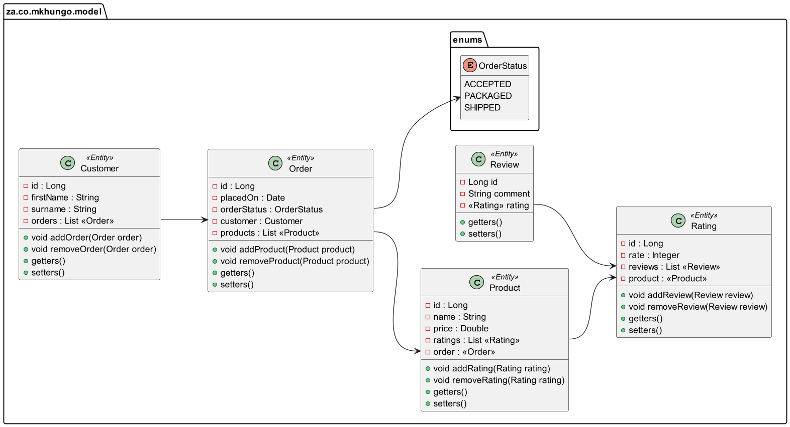
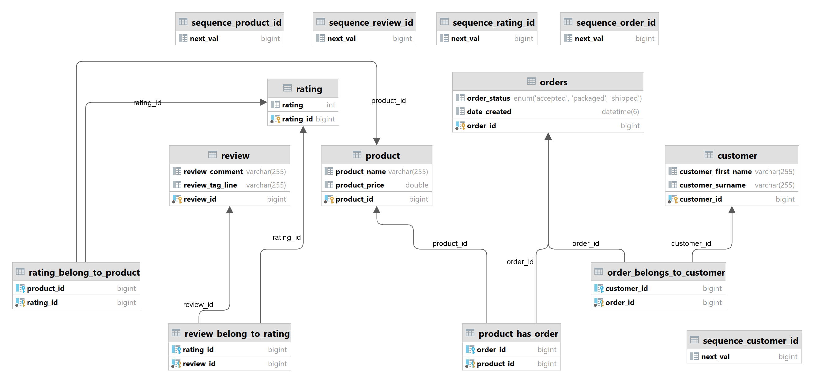

# Spring-Boot JSON Node Tree Model
### Introduction
Proof of concept Flat JSON into JSON Node Tree Model (hierarchical)
Breaking it into individual objects ,
Creating a root node, Connecting each object to its parent node ,
assembling nodes to form a tree and returning the completed tree structure.

 Hierarchical / Node Tree Model JSON
```
{
	"customers": {
		"customer": [
			{
				"id": 200,
				"firstName": "Noxolo",
				"surname": "Mkhungo",
				"orders": {
					"order": [
						{
							"id": 500,
							"placedOn": "2024-07-14T23:20:28.113748",
							"orderStatus": "PACKAGED",
							"products": {
								"product": [
									{
										"id": 100,
										"name": "Chocolate bar",
										"price": 43.99
									},
									{
										"id": 101,
										"name": "Still Water",
										"price": 75.22
									}
								]
							}
						}
					]
				}
			},
			{
				"id": 201,
				"firstName": "Mandisa",
				"surname": "Sodi",
				"orders": {
					"order": [
						{
							"id": 501,
							"placedOn": "2024-07-14T23:20:28.128708",
							"orderStatus": "SHIPPED",
							"products": {
								"product": [
									{
										"id": 102,
										"name": "Cool Drink",
										"price": 15.22
									}
								]
							}
						}
					]
				}
			}
		]
	}
}
```




## Architecture : Design Pattern
- Microservice Architecture Design Pattern

# Technologies Used:

🔘   Springframework 6 <br/>
🔘   Spring-Data 3 <br/>
🔘   Hikari Connection Pool <br/>
🔘   Hibernate - ORM <br/>
🔘   MySQL Database <br/>
